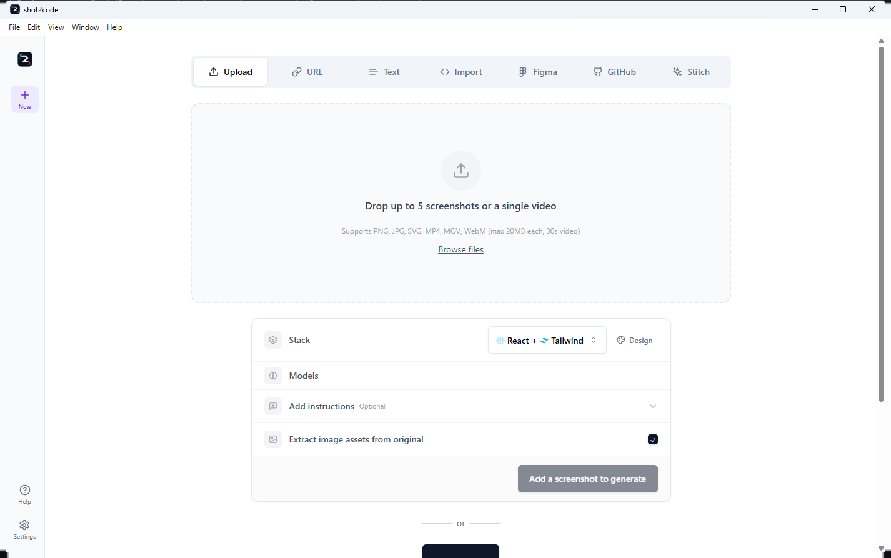
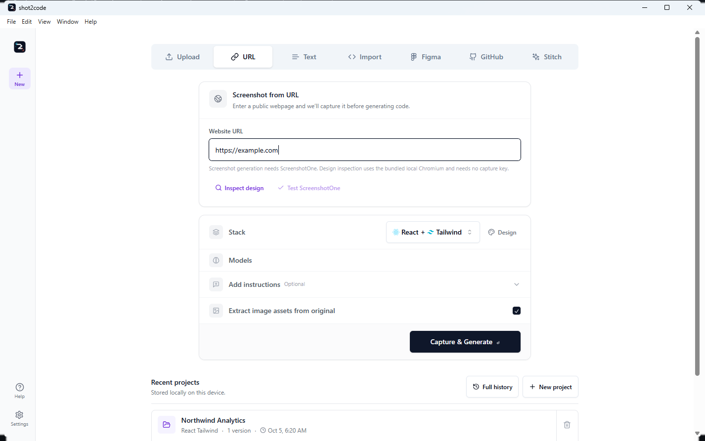
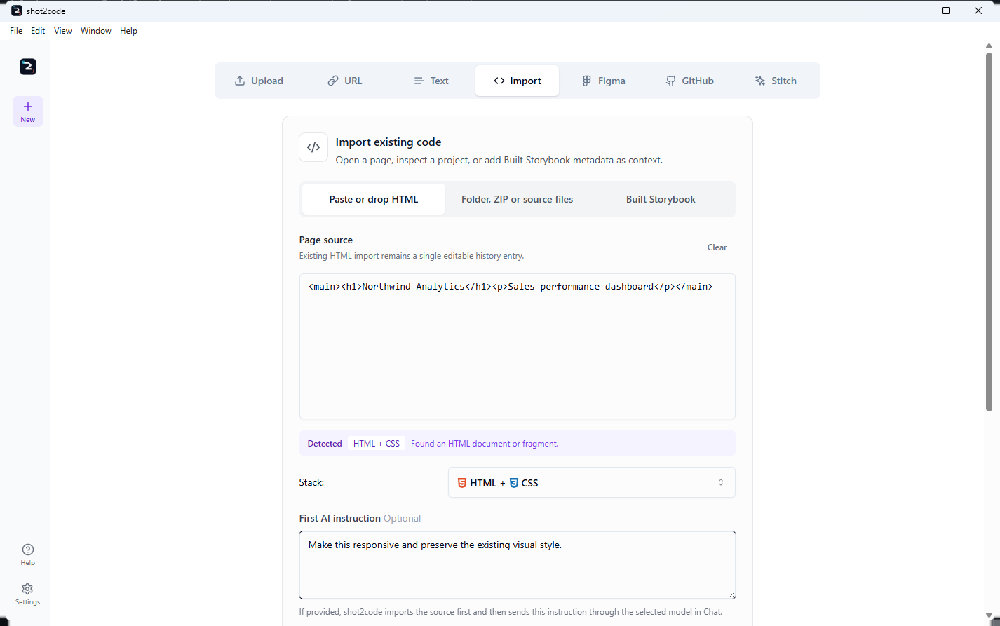
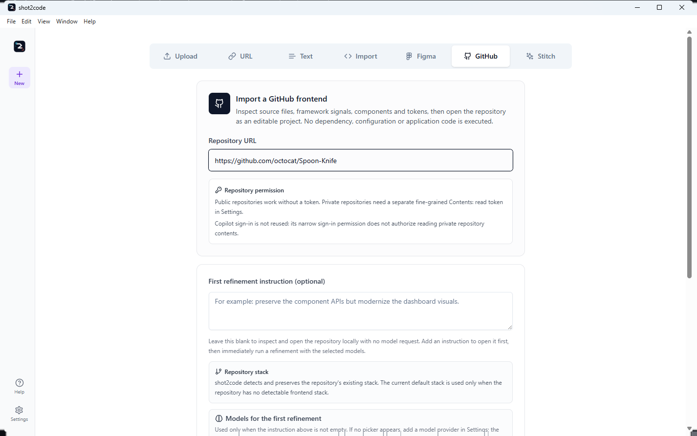
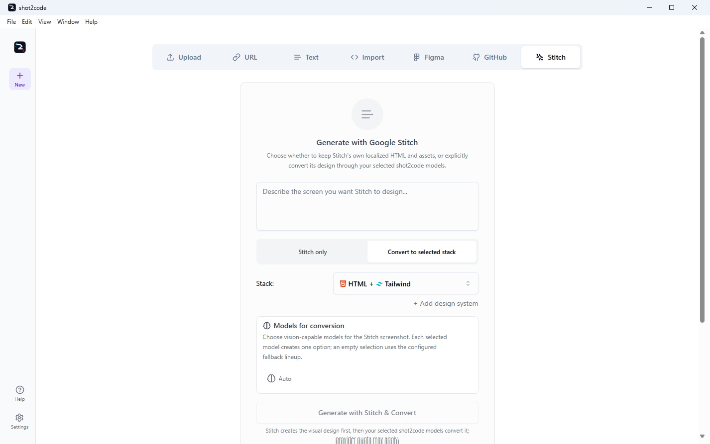

# shot2code

**Turn the reference you have into an editable web project — on your own machine.**

shot2code is a **Windows desktop app**. Start with screenshots, a public
website's computed design, Figma assets, a direct Google Stitch project, a
GitHub frontend, a description or a recording, then edit, version, refine and
export the result. Stitch can open directly without a second model call;
generation runs from your machine against the provider you configure. Project
history and normalized imported assets stay local, while credentials go only
to the integration they belong to.

**[Product site](https://arasanirohithreddy.github.io/app-releases/shot2code/)**
**[Downloads](https://arasanirohithreddy.github.io/app-releases/shot2code/releases/)**
**[Install](INSTALL.md)** **[User guide](USER-GUIDE.md)**
**[Input tabs](INPUT-TABS.md)** **[FAQ](FAQ.md)**
**[Troubleshooting](TROUBLESHOOTING.md)**

Source code, issues about the code itself, and the upstream release notes live in
the project repository: **<https://github.com/ArasaniRohithReddy/shot2code>**.
This hub is where the Windows builds and their documentation are published.

## What you need

| Requirement | Detail |
| --- | --- |
| Operating system | Windows 10 or 11, 64-bit (x64). No macOS or Linux builds — run from source there. |
| Disk | The installer unpacks roughly 600 MB: the Python backend and a headless Chromium ship inside the app. |
| A model provider | **One** of: a GitHub Copilot sign-in (no API key), a Gemini, Anthropic or OpenAI API key, or a **Copilot SDK BYOK** connection to your own endpoint (no Copilot subscription needed). The existing BYOK localhost path includes a local Ollama preset. |

Without a provider, generation fails fast and says so. The app does not ship a
model and cannot generate anything on its own.

Signing in to GitHub Copilot needs **nothing installed**: the desktop app runs
its own GitHub OAuth device flow, shows a one-time code and opens your browser.
The `gh auth login` / `copilot` ladder and a pasted token still work.

## The seven input tabs

Every screenshot below comes from the current packaged app. The
[input-tab guide](INPUT-TABS.md) explains prerequisites, limits, privacy and
output for each path.

| Upload | URL |
| --- | --- |
|  |  |

| Text | Import |
| --- | --- |
|  |  |

| Figma | GitHub |
| --- | --- |
|  |  |

| Stitch |
| --- |
|  |

Built Storybook is visible inside Import as its own inert metadata path:

## Current integrations and history

| Local Ollama preset | Bounded page reading |
| --- | --- |
|  |  |

| Localized icons | Chat tool inventory |
| --- | --- |
|  |  |

| Full history | Expanded project History |
| --- | --- |
|  |  |

## What you can do

| Task | Where | Result |
| --- | --- | --- |
| Generate from a reference | Upload a screenshot, paste a URL, describe a screen, or record one | A working page in the stack you chose, usually as several parallel options |
| Start from a Figma design | **Figma** — exported screenshots or SVG, or a REST import with your own access token | Rendered frames plus original image fills and export-marked nodes as reusable local assets; Figma REST does not provide application source code |
| Start from a Google Stitch screen | **Stitch** — the official MCP server, or the bundled experimental SDK with your Stitch API key | **Stitch only** opens localized HTML, screenshot, images, stylesheets, fonts and `DESIGN.md` directly; conversion exposes its own model picker and filters it to image-capable choices |
| Inspect a public website | **URL → Inspect design** | Bounded local-Chromium evidence, lazy-content scrolling, full-page responsive previews with actual blank/truncation metadata, and an editable/exportable `DESIGN.md`; screenshots stop at 40,000px or 36 million pixels |
| Open a GitHub frontend | **GitHub** tab | Leave the first instruction blank for a local open, or choose edit models plus a design system for an immediate refinement; the detected repository stack is preserved |
| Say what you want up front | The instruction box on **Upload** and **Import** | The first generation follows your instruction instead of guessing |
| Choose which models try it | **Settings → Models**, or the picker beside the composer | One option per selected model, across Copilot, OpenAI, Anthropic, Gemini and your own BYOK endpoint |
| Use your own endpoint | **Settings → GitHub Copilot SDK BYOK** | Models served by your OpenAI-compatible, Azure OpenAI or Anthropic endpoint, including a one-action local Ollama preset over the existing localhost path |
| Sign in to Copilot in the app | **Settings → Sign in with GitHub** | A one-time code and your browser; the token is encrypted on this device, and disconnecting never signs out `gh` or the Copilot CLI |
| Check a provider before generating | **Settings → Connection checks**, or **Test model access** | One tiny request per provider, answered as Ready, Out of credit, Key rejected, Rate limited, Access denied, Model unavailable, Configuration problem or unreachable |
| Give Copilot runs extra tools | **Settings → MCP servers**, including the official **MCP Registry** | Tools from MCP servers you enable *and* trust, offered to Copilot and BYOK options |
| Add reusable instructions | **Settings → Agent Skills** — a local folder or a public GitHub folder | Skills you can enable per run; imported disabled, and their scripts can never execute |
| Research current APIs or read one page | **Settings → Web research** | Bounded Tavily/Exa snippets, plus a separately opted-in `read_web_page` tool with public-only URL, byte, text and call budgets; built-in `web_fetch` stays blocked |
| Create or find visual assets | **Settings → Image generation / Free image search / Iconify design add-on** | Provider-billed generation, keyless Openverse CC0/PDM photography, and currently-keyless sanitized/localized Iconify SVGs with provenance |
| Refine it | Chat panel, paste screenshots, or select an element in the preview | A new version that keeps the previous one — with the whole conversation, answers and pasted PNG/JPEG/WebP references still readable |
| Edit the source | Code tab | Multi-file tree, editor, whitespace-only **Format**, file badges — plus a read-only **Export project** view of what the ZIP will hold |
| See it as a real project | **Preview → Stack preview** | The controlled Vite HTML/React/Preact files rendered in the same sandbox, with no build scripts run |
| Check it at several widths | **Review** | Source plus bounded per-frame runtime checks, categories, filtered select-all, frame isolation, explicit healthy/stale/partial coverage, schema-v2 JSON, optional no-tools AI review and Design Inspector |
| Set how the width is shared | Drag (or keyboard-move) the chat and file-explorer dividers | A remembered view preference that never touches a project's versions |
| Step back through earlier attempts | **History** | Expand every version for requested models, options, prompts, responses, activity, status and retry/branch ancestry |
| Reopen earlier work | **Recent projects → Full history** | Search every local project and inspect its complete version/option/model/prompt/activity ancestry before opening it; upgrades keep the database |
| Reuse an existing project or component library | **Import → Folder, ZIP or source files / Built Storybook** | Normalized editable source, compact design context, or fixed JSON-only Storybook metadata without executing stories, bundles or iframes |
| Drive it from the menu bar | **File · Edit · View · Window · Help** | The same commands as the keyboard, with project-only items disabled until they apply |
| Find a guide, or the log to attach | **Help** in the rail, or **Ctrl+/** | Get started, Guides, Support, shortcuts — and **Open diagnostic logs** in the desktop app |
| Send feedback | **Help → Feedback** | Direct submission through an authenticated GitHub CLI, or copy/download/browser fallbacks that attach no private app data |
| Take it away | **Download** | A single self-contained HTML file, or a Vite project folder |

## Output stacks

HTML + Tailwind · HTML + CSS · React + Tailwind · Vue + Tailwind · Bootstrap ·
Ionic + Tailwind · Alpine.js + Tailwind · Preact + Tailwind · Tailwind + daisyUI ·
Bulma · Material 3 · htmx + Tailwind

Each stack has an explicit single-HTML and project-folder export strategy, so the
download builds rather than being a plausible-looking scaffold. See
[USER-GUIDE.md](USER-GUIDE.md#exporting-a-project).

## Model providers

| Provider | Setup | Notes |
| --- | --- | --- |
| **GitHub Copilot** | **Sign in with GitHub** in Settings — a one-time code and your browser, with no command-line tool required. `gh auth login` / `copilot` still work — needs an active Copilot subscription | No API key to manage; reaches Claude, GPT, Gemini and Grok models. The model list is discovered from your account |
| Gemini | API key in **Settings** | Also powers video input and asset extraction |
| Anthropic | API key in **Settings** | |
| OpenAI | API key in **Settings** | |
| **Copilot SDK BYOK** | Your own endpoint and credential in **Settings** | Optional and additive. OpenAI-compatible (any `https://` endpoint, or `http://` on `localhost`), Azure OpenAI or Anthropic. **No Copilot subscription required.** No Gemini equivalent |
| **Ollama (local preset)** | Install Ollama and a compatible model, then choose **Configure local Ollama** in the BYOK card | Uses `http://localhost:11434/v1`; no paid API is required for local inference, but you supply hardware and a separately licensed model with image input and tool calling |
| Replicate | Key in **Settings** or `REPLICATE_API_KEY` | Default-compatible image generation; editing and background removal |
| Cloudflare Workers AI | Account id and token in **Settings** | Additive image generation with its own credential |
| OpenAI-compatible images | Endpoint and dedicated key in **Settings** | Additive generation and capability-checked editing |

All of these support **model selection**: tick as many models as you like in
**Settings → Models** or in the picker beside the composer, and each run
produces one option per selected model, up to the per-run limit. Tick nothing to
leave it automatic. See
[USER-GUIDE.md](USER-GUIDE.md#choosing-which-models-run).

**BYOK is a separate connection, not a replacement.** It carries its own API key
or bearer token — the direct OpenAI and Anthropic keys are never borrowed for
it — and only an OpenAI-compatible endpoint on `localhost` may run without a
credential. Its models appear under **Copilot SDK (BYOK)** with the run identity
`sdk-byok/<provider>/<base model>`, so a model and its BYOK twin can run in the
same generation and be compared. Configuring it changes nothing about how the
native providers behave. The **Configure local Ollama** action fills
`http://localhost:11434/v1` on this same connection. shot2code does not bundle
Ollama or a model; local inference uses your hardware, model licences and
capabilities vary, and Ollama cloud services are separate. See
[Ollama's OpenAI-compatibility documentation](https://docs.ollama.com/api/openai-compatibility) and
[USER-GUIDE.md](USER-GUIDE.md#using-your-own-endpoint-copilot-sdk-byok).

**It also reaches models the catalogue does not know.** Name the ids your
endpoint serves — discovered from its `/models` route where one exists, typed by
hand otherwise — and each becomes a single honest option,
`<model> via <provider>`, with the identity
`sdk-byok/<provider>/custom/<model>` carried through History and retries. One
connection can offer several such models, and they can run side by side in the
same generation. The wire API is chosen automatically: Chat Completions for an
endpoint with its own base URL, Responses for a provider's own. Any such model
must support **image input and tool calling**, which only the endpoint's
documentation can confirm.

**Test before you generate.** **Connection checks** under the API keys test
OpenAI, Anthropic, Gemini and Replicate individually with one minimal request,
so an unpaid account or a revoked key is reported — with the action that fixes
it — before a generation is half-finished.

## MCP servers, skills and web research

Up to eight Model Context Protocol servers can be configured in **Settings** over
**stdio**, **HTTP** or **SSE**, either by hand or from the official
**MCP Registry** browser. A server must be **enabled** and explicitly
**trusted** before shot2code starts it, remains read-only until **Allow write
tools** is enabled, and is launched without a shell. Registry and featured
Google Stitch entries arrive as disabled, untrusted drafts. Figma MCP endpoints
are filtered because Figma accepts only clients listed in its MCP Catalog.

**Agent Skills** are local/public-GitHub instruction folders. They are validated,
stored with provenance and disabled by default. Their script files remain inert
resources because shot2code exposes no shell or unrestricted host-filesystem
tool.

MCP tools and Agent Skills are available only to **GitHub Copilot** subscription
and **Copilot SDK BYOK** variants. Native OpenAI, Anthropic and Gemini variants
never receive them. MCP write access is separately visible and consented.

The **Tools** control beside Chat is an inventory, not a bypass. It reports
project editing, Chromium preview verification, web search, bounded page
reading, public-domain photos, generated-image readiness and provider billing,
localized icons, valid enabled+trusted MCP servers (including write scope), and
enabled Skills. Merely appearing in the list enables nothing; **Manage tools**
opens the relevant Settings consent.

Provider-neutral research tools are different from MCP/Skills:

- `search_web` sends bounded queries to Tavily or Exa from every runtime and
  returns capped untrusted snippets. Provider allowances belong to those
  services and can change; the app links their official pricing pages.
- `read_web_page` has a **separate off-by-default switch**. It accepts one public
  HTTP(S) URL on a standard port, no credentials or query string, sends no
  cookies/auth, downloads at most 512 KB, strips active HTML, returns at most
  16,000 untrusted characters, and allows two reads per turn and five per
  generation. Turning on search never turns on page reading.
- `search_icons` is another separate opt-in available to every runtime. It uses
  only `https://api.iconify.design`, sanitizes and locally persists selected SVG,
  restricts automatic results to a permissive SPDX allowlist, and embeds source,
  author, licence and retrieval provenance. Iconify's public API currently
  accepts keyless requests (checked 2026-10-04), but publishes no fixed public
  quota or SLA, so access can change. Verify upstream metadata and brand/trademark
  rights. See the [Iconify API docs](https://iconify.design/docs/api/).

Copilot's built-in search is used only when canonical search is unavailable.
The runtime-owned built-in `web_fetch` remains blocked: its whole-page result
reaches the model before shot2code can truncate, label or budget it, so it is
never a fallback for `read_web_page`. See the
[tool-safety guide](USER-GUIDE.md#agent-skills-web-research-and-chat-tools).

## Design sources: Figma, Storybook and Google Stitch

Besides screenshots, a URL, a description or a recording, shot2code can start
from a design tool:

| Source | How |
| --- | --- |
| **Figma** | Exported screenshots/SVG, or a REST import that can preview rendered frames before a model call, reuse them for generation, and preserve image fills plus export-marked local assets |
| **Google Stitch** | The official Stitch MCP, or the bundled experimental SDK. Stitch-only mode directly opens the localized HTML/assets/`DESIGN.md`; conversion through selected models is explicit |
| **Public website** | The URL inspector proxies public-only resources, scrolls bounded lazy content and captures bounded full-page desktop/tablet/mobile evidence with actual dimensions and blank/truncation metadata |
| **Built Storybook** | A built folder, selected JSON files, ZIP or public HTTPS root; only fixed metadata JSON is parsed, never story code, bundles or `iframe.html` |
| **GitHub repository** | Public URL with no token, or a separate repository-limited fine-grained token with `Contents: read` for a private repo. Blank first refinement opens locally; a non-empty one exposes edit models and design system while preserving the detected stack |

Both credentials are **capture-only**. The Figma token is sent to `api.figma.com`
and nowhere else, the Stitch key reaches only the bundled SDK, and neither is
included in a generation request, in project history or in an export. Figma's
desktop and hosted MCP servers admit only clients in Figma's own catalogue, and
shot2code does not impersonate another editor — REST/PAT is the supported
programmatic route. `@google/stitch-sdk` is published by Google Labs
and is explicitly not an officially supported Google product.

Imported design/repository images are persisted under shot2code's local asset
store and referenced through restart-safe identifiers. Binary project files
remain previewable and export as decoded bytes rather than base64 text. Every
external design document, website string and repository file is untrusted data,
never an instruction source.

## Image generation, public-domain photos and icons

Image generation is additive and provider-specific:

- **Replicate** is the default-compatible provider and the only one used for
  background removal. Curated models declare their own input shape; a custom
  model is accepted only after its published schema proves a string prompt and
  image output with no extra required inputs.
- **Cloudflare Workers AI** uses its own account id/token.
- **OpenAI-compatible images** use a dedicated endpoint/key and expose editing
  only when `/images/edits` actually exists.

Every prompt keeps its own success or classified failure. Partial batches report
**Generated X of N**; an all-failed batch fails instead of returning empty image
URLs. After a credential, billing, quota, permission, model or configuration
failure, a per-generation circuit breaker blocks repeated paid/provider calls.
The run is directed to another honest asset path — public-domain photos,
localized icons, extracted assets, CSS or SVG — or the user fixes Settings and
starts a new generation.

**Free image search** is a separate, opt-in Openverse tool. It does not silently
replace generation. Only CC0/Public Domain Mark records with a source and
licence URL survive local checks, and selected images are downloaded through
DNS/private-address, redirect, MIME, byte and decoded-pixel limits before being
stored locally. Openverse aggregates third-party metadata, so verify the source.
The public API currently works without a shot2code credential, but provider
access and limits can change.

Arbitrary Google, Bing or general web-image results are deliberately not inserted
into exported projects: appearing in a search result grants no reuse right. Use
Openverse for conservatively licensed photography and the opt-in Iconify path for
interface icons. Iconify SVG is sanitized and localized rather than hotlinked;
its embedded provenance does not grant trademark rights for a brand icon.

## Reviewing what was generated

**Review** renders the generated page at two to four real CSS widths — 1440,
768 and 390 by default, any whole width from 320 to 1920 — and combines a local
source audit with bounded runtime evidence from each sandboxed frame. Runtime
checks cover horizontal overflow, accessible names, custom keyboard focus,
target-size advisories, image alternatives/load failures, headings and main
landmarks; a failed frame is isolated so source and other viewport results stay
usable.

Findings carry **Accessibility, Structure, Responsive or Document** categories,
source/runtime provenance and viewport evidence. Severity/category/query
filters plus filtered select-all preserve hidden selections. The health summary
states whether coverage is healthy, needs attention, partial or stale and binds
the result to the exact version, option, source hash and viewport set.

Selected fixes target that exact reviewed option. The optional AI review uses
the recorded model with **no tools, MCP, Skills, web search or writes** and may
consume provider quota; local findings remain authoritative. Schema-v2 JSON
reports include findings, coverage and safe relative file labels, never source
credentials. The Design Inspector still exports `DESIGN.md`, `SKILL.md` and a
palette PNG.

These are automated source and bounded runtime signals, **not WCAG
certification**. Manual keyboard, screen-reader, zoom and interaction testing is
still required. See [USER-GUIDE.md](USER-GUIDE.md#the-review-workspace).

## What it does not do

- It is **not** a hosted service and has no account, sync or cloud storage.
- It does **not** include a model or a provider allowance. A local Ollama run can avoid a paid inference API, but Ollama, hardware and a suitably licensed/capable model remain yours to install and operate.
- It does **not** run a shell, and it exposes no unrestricted host-filesystem
  tool. An imported skill may ship scripts; they are stored, never executed.
- It does **not** guarantee that generated code is correct, accessible or secure.
  It is model output: review it before running it outside the sandboxed preview.
- The published Windows binaries are **not code-signed**, so SmartScreen will warn
  on first run. Verify the SHA-256 checksum instead — see [SECURITY.md](SECURITY.md).

## Documentation

| Guide | What it covers |
| --- | --- |
| [INSTALL.md](INSTALL.md) | Downloads, checksum verification, SmartScreen, updates, uninstall |
| [USER-GUIDE.md](USER-GUIDE.md) | First run, providers and local Ollama, Chat Tools, bounded research, Storybook/Figma/Stitch/GitHub inputs, Review, Full history and export |
| [INPUT-TABS.md](INPUT-TABS.md) | Every input tab with current screenshots, prerequisites, steps, limits, privacy boundaries and output |
| [FAQ.md](FAQ.md) | Common questions, in the order people ask them |
| [TROUBLESHOOTING.md](TROUBLESHOOTING.md) | Symptom-first runbook: startup, providers, Figma/Stitch, website/GitHub import, Chromium, Preview/export, updates and logs |
| [ARCHITECTURE.md](ARCHITECTURE.md) | How the app, backend, agent loop and packaging fit together |
| [DATA-HANDLING.md](DATA-HANDLING.md) | Every network destination and on-disk path |
| [SECURITY.md](SECURITY.md) | Reporting a vulnerability, unsigned builds, update integrity |
| [CONTRIBUTING.md](CONTRIBUTING.md) | Where issues, documentation fixes and code changes each go |
| [THIRD-PARTY-NOTICES.md](THIRD-PARTY-NOTICES.md) | Bundled runtimes and principal dependencies, with links to the source manifests |
| [RELEASING.md](RELEASING.md) | How a build becomes a release in this hub |
| [CHANGELOG.md](CHANGELOG.md) | What changed in each published version |

Bugs and ideas belong in this hub —
[open an issue](https://github.com/ArasaniRohithReddy/app-releases/issues/new/choose)
and pick **shot2code**. Vulnerabilities are [reported privately](SECURITY.md).
The hub's [support policy](../../SUPPORT.md) covers triage for every product
published here.

## License

The application is MIT-licensed in its
[source repository](https://github.com/ArasaniRohithReddy/shot2code/blob/main/LICENSE).
The documentation and release assets in this hub are provided under the
[MIT License](../../LICENSE). Components that ship inside the app — Electron and
Chromium, the frozen Python runtime, the headless browser — are listed in
[THIRD-PARTY-NOTICES.md](THIRD-PARTY-NOTICES.md).
