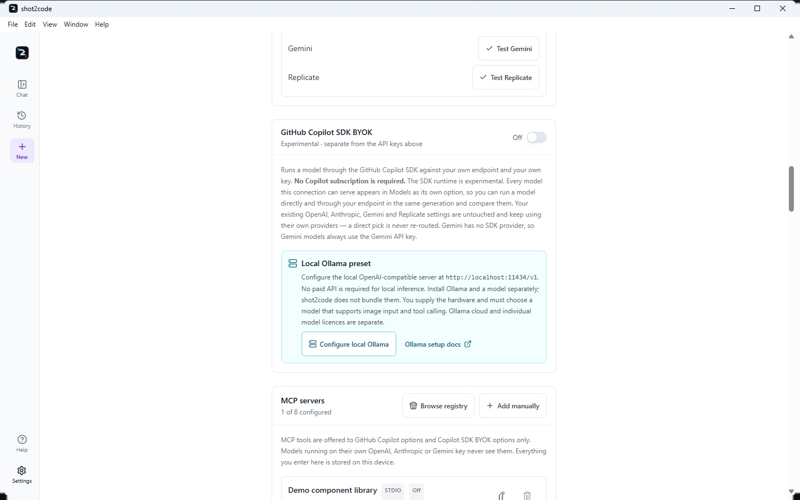
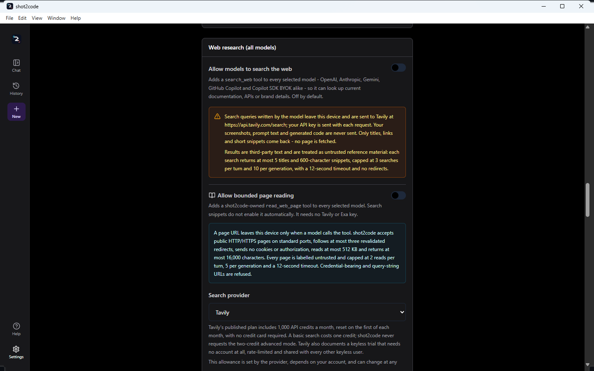
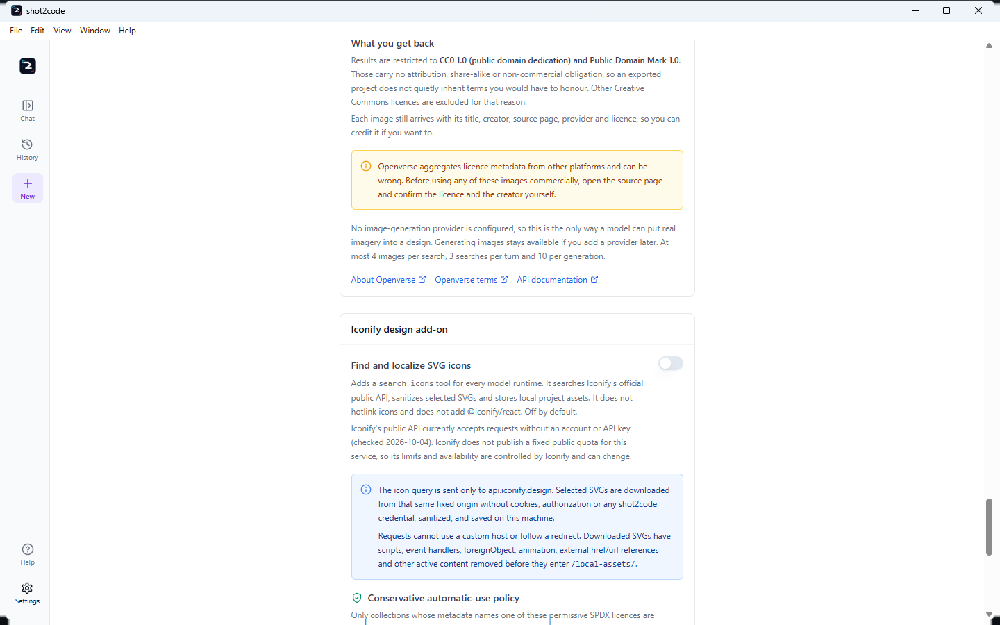
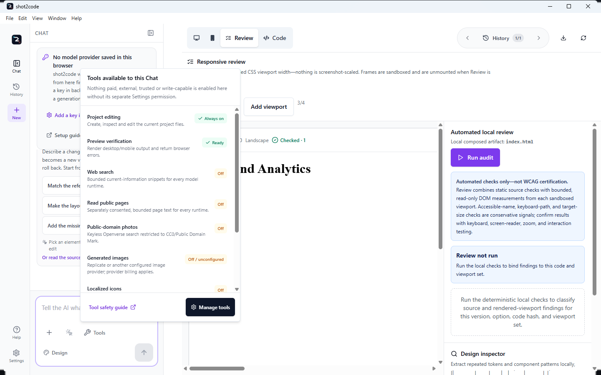
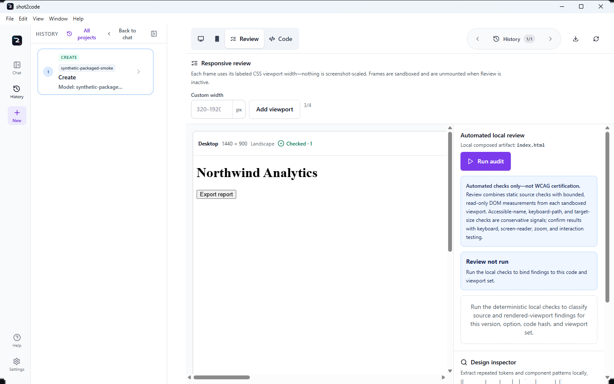
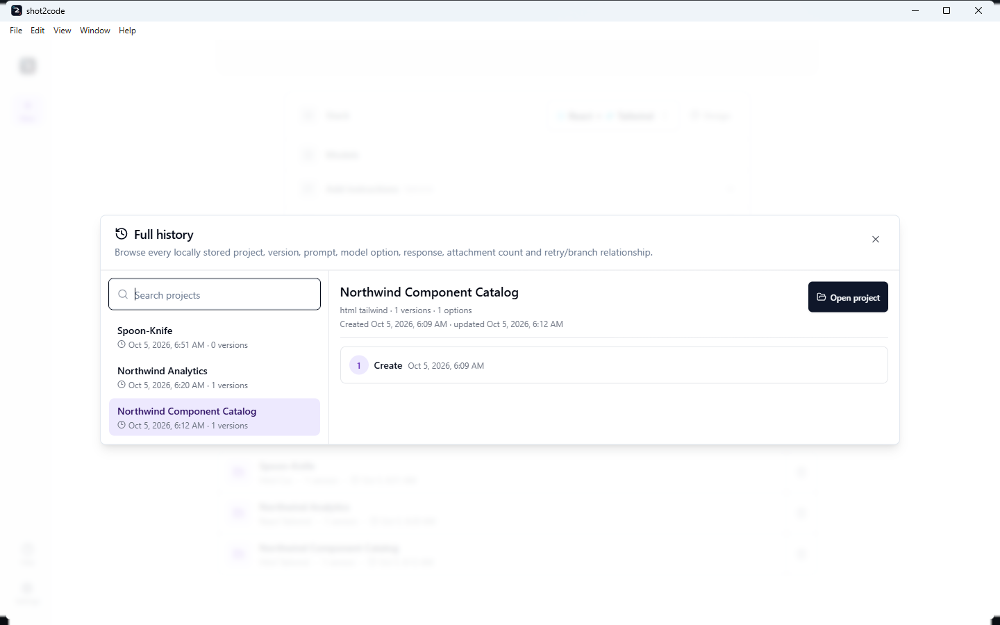
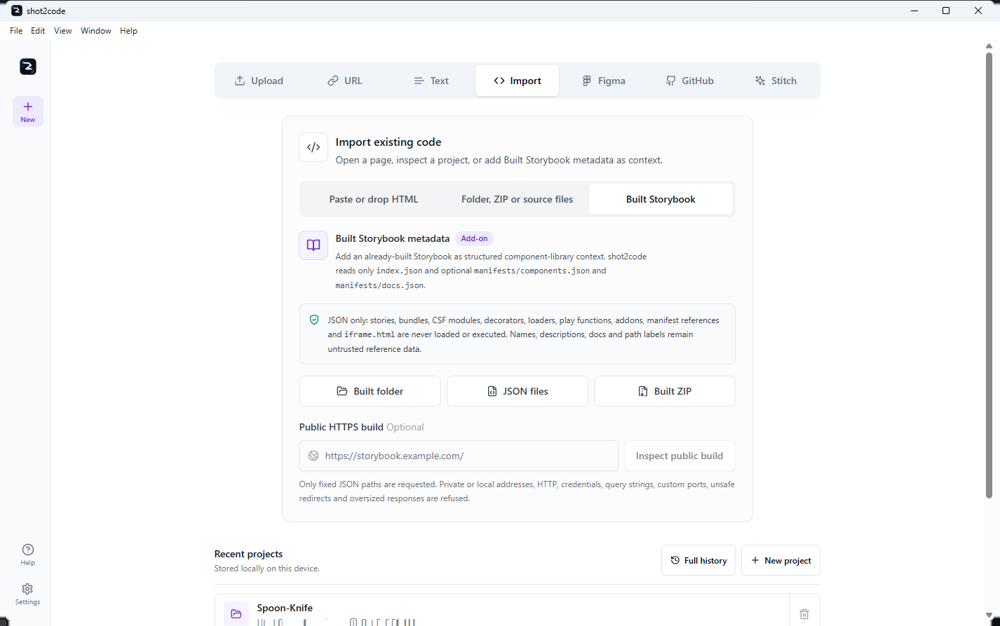

# shot2code user guide

Everything below describes the published Windows build. If something here does
not match what you see, check the version in **Settings** against
[CHANGELOG.md](CHANGELOG.md). If something is failing rather than merely
unfamiliar, [TROUBLESHOOTING.md](TROUBLESHOOTING.md) is the symptom-first
runbook. The application itself is developed at
[ArasaniRohithReddy/shot2code](https://github.com/ArasaniRohithReddy/shot2code).

- [First run](#first-run)
- [The seven input tabs](#the-seven-input-tabs)
- [Choosing a model provider](#choosing-a-model-provider)
- [Using your own endpoint (Copilot SDK BYOK)](#using-your-own-endpoint-copilot-sdk-byok)
- [Choosing which models run](#choosing-which-models-run)
- [MCP servers](#mcp-servers)
- [Agent Skills, web research and Chat Tools](#agent-skills-web-research-and-chat-tools)
- [Figma and Google Stitch](#figma-and-google-stitch)
- [Generating your first page](#generating-your-first-page)
- [Using more than one screenshot](#using-more-than-one-screenshot)
- [Refining the result](#refining-the-result)
- [The Code tab](#the-code-tab)
- [The Review workspace](#the-review-workspace)
- [Sizing the workspace](#sizing-the-workspace)
- [History and retries](#history-and-retries)
- [Recent projects and Full history](#recent-projects-and-full-history)
- [Importing an existing project](#importing-an-existing-project)
- [Preview, CodePen and sharing](#preview-codepen-and-sharing)
- [Exporting a project](#exporting-a-project)
- [The menu bar](#the-menu-bar)
- [Keyboard shortcuts](#keyboard-shortcuts)
- [The Help centre](#the-help-centre)
- [Settings](#settings)
- [When something goes wrong](#when-something-goes-wrong)

## First run

Install it with the [install guide](INSTALL.md), then start it. The splash screen
stays until the bundled backend answers its health check, which from 0.3.3 is
normally a few seconds — around 5–11 seconds on a warm machine, and longer the
first time a fresh portable copy or a freshly updated install has to be scanned.
The shell gives up after 90 seconds rather than waiting indefinitely; if you hit
that, see [TROUBLESHOOTING.md](TROUBLESHOOTING.md#the-app-will-not-start).

Only the core routes have to be ready for the window to open. Generation,
evaluation and project tooling are loaded the first time you use them, and the
Chromium and Copilot checks run in the background — so an optional capability
that is slow or missing no longer holds up the app. After the renderer loads,
the Electron shell also checks for a genuinely empty top-level document. It
reloads one blank window once and, if it remains empty, shows a static recovery
screen that says local projects are still stored instead of leaving an
unexplained white window.

The chat panel shows a **provider status callout**. It only states what the app
can actually see from the window:

- *"No model provider saved in this browser"* — no key has been entered here. The
  app will still try credentials it cannot see from the UI, such as a GitHub
  Copilot sign-in or a key in `backend/.env`.
- *"… saved on this device"* — a key exists.

It never claims a provider is connected or verified, because that is only proved
by a real request. The callout's actions are **Add a key in Settings** and
**Setup guide**.

## The seven input tabs

The New-project screen is organized by the evidence you already have:

| Tab | Best starting point | What it creates |
| --- | --- | --- |
| **Upload** | Screenshots, exported SVG, video, or screen recording | Generated options in the selected stack |
| **URL** | A public website | A local `DESIGN.md` inspection, or a captured screenshot generation |
| **Text** | A written brief | Generated options in the selected stack |
| **Import** | HTML, folder, ZIP, selected source files, or built Storybook metadata | Design context or an editable imported project; Storybook stays fixed JSON-only |
| **Figma** | A Figma file/frame URL | Rendered frames/assets, then generated implementation |
| **GitHub** | A public/private frontend repository | A local editable open, or an optional first refinement with selected models and design system while preserving the detected stack |
| **Stitch** | A Stitch prompt or project/screen | Direct localized Stitch project, or explicit stack conversion |

Video is part of **Upload**, not a separate tab. Public-site design inspection
needs no ScreenshotOne key, public GitHub repositories need no token, and
Import/GitHub/Stitch-only projects can open without a code-generation request.

The dedicated **[Input tabs guide](INPUT-TABS.md)** includes current screenshots
of every tab and documents exact credentials, steps, limits, privacy boundaries,
and outputs.

## Choosing a model provider

You need **one** provider.

### GitHub Copilot (no API key)

The quickest route is the button: **Settings → GitHub Copilot → Sign in with
GitHub**. In the desktop app this runs **shot2code's own GitHub OAuth device
flow**: it shows a one-time code, opens your browser, and finishes without the
GitHub Copilot CLI or the GitHub CLI being installed at all. The application is
registered with a **public client id and no client secret**, because a desktop
app cannot keep one.

The credential it receives — an access token and its refresh token — is stored
under the app's own user-data folder and **encrypted with Electron
`safeStorage`**, the operating system's key store. It is refreshed for you when
it expires, and the backend is handed the token on a restart that is serialised,
so repeated sign-in or disconnect clicks cannot race each other.

**Disconnect GitHub from shot2code** clears only what *this app* holds. A
`gh auth login` or `copilot` session on the same machine **stays signed in** —
shot2code did not create it and does not end it. The app says so rather than
leaving you to check.

Where that flow is unavailable — the browser development build — the button
falls back to the **official** GitHub Copilot CLI web-flow login (and then the
GitHub CLI), which opens your browser and stores the credential in that tool's
own keychain. In that mode **shot2code never receives or saves your token**; it
only learns afterwards whether a session exists. Either way you can cancel while
it is waiting, and if no route is available the app says so and links the
official install instructions rather than pretending to sign you in.

The terminal route still works, and is unchanged:

```powershell
gh auth login        # or: copilot
```

Restart shot2code and open **Settings** — it shows which account was picked up.
An active Copilot subscription is required.

Credentials are resolved in this order:

1. A token pasted into **Settings**
2. `COPILOT_GITHUB_TOKEN` / `GH_TOKEN` / `GITHUB_TOKEN` — which is how the
   token from the in-app sign-in reaches the backend
3. A stored `copilot` CLI login
4. A stored `gh auth login`

If you would rather use a token, create a fine-grained token with the
**Copilot Requests** permission and paste it into Settings.

Copilot's model list is the one your account actually has — see
[Choosing which models run](#choosing-which-models-run).

### API keys

Paste a **Gemini**, **Anthropic** or **OpenAI** key into **Settings**. Keys are
stored on this device and sent with the generation request to that provider only.
Every key field is masked as you type.

Two capabilities need a specific provider:

| Capability | Needs |
| --- | --- |
| Video / screen-recording input, asset extraction | A Gemini key |
| Image generation | Replicate, Cloudflare Workers AI, or an OpenAI-compatible image endpoint configured in Settings |
| Image editing | Replicate, or an OpenAI-compatible endpoint that implements `/images/edits` |
| Background removal | Replicate only |
| Free licensed image search | Nothing except opting in; queries go to Openverse and results are restricted to CC0/Public Domain Mark |

### Testing a provider before you generate

Under the keys, **Connection checks** gives OpenAI, Anthropic, Gemini and
Replicate a **Test** button each. A test makes **one deliberately tiny
request** — a single-word prompt capped at 16 tokens — so a credential that is
malformed, revoked, out of credit or pointed at a model your account cannot see
fails there rather than halfway through a generation.

- Only the tested provider's credential is sent. Testing Gemini never puts your
  OpenAI key on the wire.
- Leave a field empty and the test uses the key the backend holds in its own
  configuration instead, so you can check that too.
- On a metered account a test may use **a small amount of quota**. Replicate is
  checked against its account endpoint, so it starts no prediction.

The answer is always something you can act on:

| Result | What it means |
| --- | --- |
| **Ready** | The provider answered the test request |
| **Out of credit** | The key works, but the account has nothing left to spend. Links straight to that provider's billing page |
| **Key rejected** | The credential was refused — check it for a typo or issue a new one |
| **Rate limited** | Temporary. Wait for the limit to reset, or generate fewer options at once |
| **Access denied** | The account does not have access to that model |
| **Model unavailable** | The provider does not offer the model that was tried |
| **Configuration problem** | Something in the setup is wrong — usually a missing key or a base URL |
| **Could not reach the provider** | A network, proxy or firewall problem |

**Out of credit** is the case this exists for. Providers report an empty balance
in a way that reads like a rate limit, so it is easy to spend an afternoon
re-checking a key that was fine all along.

## Using your own endpoint (Copilot SDK BYOK)

**Settings → GitHub Copilot SDK BYOK** adds a second, optional way to reach a
model: your own endpoint, through the GitHub Copilot SDK. It is **additive**.
Switching it on does not change, relabel or re-route any of the providers above,
and you can leave it off forever without missing anything.

**No Copilot subscription is required for it.** It is the Copilot *SDK* — the
runtime — not your Copilot entitlement.

### Configuring the connection

There is one connection, with its own settings:

| Field | What it is |
| --- | --- |
| **Provider** | **OpenAI-compatible**, **Azure OpenAI** or **Anthropic** |
| **Base URL** | Your endpoint. Required for Azure OpenAI. `https://` is required unless the host is `localhost` |
| **API key** | The credential **dedicated to this connection** |
| **Bearer token** | Sent instead of the API key when your gateway expects an `Authorization` header |
| **Wire API** | **Automatic** by default — see below. Pin **Responses** or **Chat Completions** only if your endpoint needs one |
| **Endpoint model** | The model id your endpoint serves, when it is not one of the catalog models |
| **Azure API version** | The `api-version` your resource expects. Azure only |

**OpenAI-compatible** is deliberately broad: it works with any endpoint that
speaks the OpenAI wire format — a vendor API, a gateway, a self-hosted server,
or one your organisation runs — over any `https://` URL, or `http://` when the
host is `localhost`.

**Validate connection** checks the settings and nothing else — no request is
made to your endpoint, and the response never contains your credential.
**Test model access** is the opposite: it contacts the endpoint, and it says so.

### The wire API is chosen for you

**Automatic** is the default and is usually right:

| Your connection | Automatic picks |
| --- | --- |
| Has its own base URL | **Chat Completions** — the interface almost every OpenAI-compatible server implements |
| Has no base URL (the provider's own endpoint) | **Responses** |

Pin a protocol only if your endpoint needs a specific one. A pinned choice
always wins, and upgrading never changes a protocol you chose deliberately.

### Naming the models your endpoint serves

If your endpoint serves models the catalog does not know, put their ids in
**Endpoint model**. There are two ways to fill it in:

- **Discovered.** If the endpoint lists models at `/models`, **Test model
  access** fills a picker with the ids it reported. Only OpenAI-compatible
  endpoints expose that route.
- **Typed.** Type the id yourself. This is always available, and it is the only
  way for **Azure OpenAI** (use the deployment name) and **Anthropic**, neither
  of which lists models here.

**Model listing is optional, and a missing one is not a failure.** Plenty of
endpoints do not expose `/models`, or refuse it to the credential you use for
inference. When you have named a model yourself, **Test model access** tests
that model directly and reports what the endpoint said about it. A rejected or
missing credential is still reported as a credential problem, and a listing
failure with **no** model configured is still reported with the fix: type the
model id, or the Azure deployment name, by hand.

You are not limited to one. Every id you pick or type becomes its own selectable
entry, so several models from the same endpoint can run in a single generation
and be compared against each other.

Ids may be up to **128** characters and may contain the `. _ : / @ + -`
characters real deployments use. Spaces are not allowed.

> The discovered list is **ids only**. It tells you what the endpoint serves,
> never which of those models can read images or call tools.

**The model must support vision and tool calling.** Screenshots are sent as
images and the agent works by calling tools, so a text-only model will fail even
if the connection check passes. Only the endpoint's own documentation can tell
you which models qualify.

### One honest option for a custom model

Name a model the catalog does not know and **Settings → Models** shows exactly
**one** entry for it — `<model> via <provider>`, with the run identity
`sdk-byok/<provider>/custom/<model>`. It deliberately does not list the catalog
model names against it: those names would be untrue, and they would all reach
the same model anyway. No reasoning effort is sent for a custom model, because
an arbitrary endpoint model has no thinking level. Name several models and you
get one such entry each, never a family of catalog names standing in for them.

That identity is what History records and what a retry replays, so re-running
the option reaches the same endpoint and the same model.

### The credential is its own

shot2code will **not** fall back to your direct OpenAI or Anthropic key for this
connection. Those belong to the native providers and keep working there
untouched. The one exception is an **OpenAI-compatible endpoint on
`localhost`**, which may run without a credential — a local Ollama, LM Studio or
vLLM server, typically.

**There is no Gemini BYOK.** The Copilot SDK has no Gemini provider, so Gemini
models always use the Gemini API key directly. The app says so as a notice
rather than leaving you to work it out.

### Local Ollama quick setup

**Configure local Ollama** fills this existing OpenAI-compatible BYOK connection
with `http://localhost:11434/v1`, clears stale remote credentials/model choices,
and leaves the native OpenAI, Anthropic, Gemini and Copilot routes untouched.
Ollama's local server ignores API-key authentication, so no paid API is required
for local inference.

That does **not** mean the app includes free compute or a model. Install and run
Ollama separately, download a model, supply the RAM/VRAM/CPU/GPU it needs, and
choose one that supports both **image input and tool calling**. Model licences
and availability vary; Ollama cloud services are separate from local inference.
Use **Test model access** to read `/models`, but confirm capabilities and licence
with the model publisher. See
[Ollama's OpenAI-compatibility documentation](https://docs.ollama.com/api/openai-compatibility).



### BYOK models are separate selections

Every model the connection can serve appears in **Settings → Models** under
**Copilot SDK (BYOK)** as its own entry, with the run identity:

```
sdk-byok/<provider>/<base model>
```

for example `sdk-byok/azure/gpt-5.6-sol (high thinking)`. No direct model id
starts with `sdk-byok/`, so the two can never be confused — which means:

- **A model and its BYOK twin can both be selected for the same generation.**
  Tick `gpt-5.6-sol (high thinking)` *and*
  `sdk-byok/azure/gpt-5.6-sol (high thinking)` and you get two options: one on
  OpenAI's own API, one on your endpoint, side by side.
- **A native pick is never re-routed.** Having BYOK switched on does not move a
  native selection onto your endpoint. There is nothing to warn about, because
  nothing is silently redirected.
- **The reasoning effort carries across.** The effort is part of the base model
  name, so the BYOK entry runs at the same effort you picked.
- **The identity is what History records.** Each option stores the identity it
  actually ran as, so retrying a BYOK option re-runs it on your endpoint rather
  than on the provider whose model it borrowed.

### An incomplete connection does not block anything

If the connection is switched off, missing its credential, or missing the Azure
endpoint, shot2code reports it as a notice beside the model picker and carries
on. Your direct OpenAI, Anthropic, Gemini and Copilot generations are
unaffected.

## Choosing which models run

Model selection is not a Copilot-only feature. **Settings → Models**, and the
compact picker beside the composer, show every model you can currently use,
grouped by provider:

| Group | Where the list comes from |
| --- | --- |
| **GitHub Copilot** | Discovered from the signed-in account — marked *Live*, because it is your plan's real entitlement |
| **OpenAI** | A maintained, validated catalogue — marked *Curated* |
| **Anthropic** | A maintained, validated catalogue — marked *Curated* |
| **Google Gemini** | A maintained, validated catalogue — marked *Curated* |
| **Copilot SDK (BYOK)** | The models your own connection can serve — marked *Yours* and *Experimental* |

A provider only appears once shot2code can see a credential for it. With none
configured, the picker says so and points at Settings and GitHub sign-in rather
than showing an empty list. The four native groups still require their own key
or sign-in: a BYOK connection never makes one of them available, and never
changes what a native group says about where its credential came from.

### Selecting one model, several, or none

- **Tick nothing** — *automatic*. shot2code chooses for you and produces the
  full number of options the run allows.
- **Tick one** — a single option, generated by exactly that model.
- **Tick several, across providers if you like** — one option per selected model,
  so you can compare an OpenAI and an Anthropic attempt at the same screenshot
  side by side.

### How many options you actually get

One option is generated per selected model, capped by the per-run limit:

| Run | Options |
| --- | --- |
| First generation from screenshots, a URL or a description | Up to 4 |
| An update to an existing version | Up to 2 |
| Anything generated from a video or screen recording | Up to 2 |

The picker states the result in words — *"3 options, one per selected model."*
If you tick more models than the run allows, it says so too: only the first
models up to the limit are used, and the rest are ignored for that run.

### Stale, deprecated and video-incapable picks

- **A saved model that can no longer run** — because the key was removed, or the
  provider retired it — is called out as *"N saved models can no longer run …
  They are ignored until you remove them."*, with a **Remove** action. Your other
  picks keep working.
- If the catalogue cannot be loaded at all, your selection is left alone rather
  than being quietly reset.
- **Deprecated models are hidden** unless you tick **Show deprecated models**, or
  you already have one selected — a pick never disappears from the list it was
  made in.
- **In video mode the list is filtered to models that can read video**, because
  everything else would fail on the input. The same is true of the Copilot list
  generally: models that cannot read images are not offered, since turning a
  screenshot into code requires image input.
- If your plan offers models this build does not support yet, the provider says
  how many — it does not pretend they are unavailable to you.

Selecting models is a preference, not a purchase: each option is still a real
request billed by the provider it belongs to.

## MCP servers

**Settings → MCP servers** lets a generation call tools from Model Context
Protocol servers you configure — a component-library lookup, a design-token
service, an internal documentation index. Up to **eight** can be configured.

### Which options actually get the tools

MCP is a Copilot SDK feature, so it reaches the runtimes that use the SDK:

| Option | Sees MCP tools? |
| --- | --- |
| A **GitHub Copilot** subscription model | Yes |
| A **Copilot SDK BYOK** model | Yes |
| A model on your own OpenAI, Anthropic or Gemini key | **No** — it runs on that provider's own client |

The picker states this for the current selection rather than leaving you to
infer it from an empty activity list. [Agent Skills](#agent-skills-web-research-and-chat-tools)
follow exactly the same rule; canonical Tavily/Exa web search is provider-neutral.

### Installing from the official MCP Registry

**MCP Registry** searches
[`registry.modelcontextprotocol.io`](https://registry.modelcontextprotocol.io)
from inside Settings, so you do not have to copy a URL out of a README. Only
remote `https://` entries are listed, and several published versions of the same
server collapse to the latest active one.

**Installing adds a disabled, untrusted draft.** The entry's URL and headers are
filled in for you to review; nothing starts until you turn on the same two
switches as any other server. A registry listing is not an endorsement, and
shot2code treats it as untrusted input.

Google Stitch is offered as a featured draft with the right transport and
endpoint already set:

| Featured | Endpoint |
| --- | --- |
| **Google Stitch MCP** | `https://stitch.googleapis.com/mcp` |

Figma restricts both its desktop and hosted MCP transports to clients listed in
the Figma MCP Catalog. shot2code therefore filters those endpoints from registry
results, disables migrated entries, and uses the documented REST/PAT workflow.

### Adding a server

| Field | Applies to | What it is |
| --- | --- | --- |
| **Name** | All | What appears in the activity list |
| **Transport** | All | **Local program (stdio)**, **HTTP** or **Server-sent events (SSE)** |
| **Command** and **Arguments** | stdio | The program to run and its arguments, one per line |
| **Environment variables** | stdio | `NAME=value` per line, or a pasted JSON object |
| **Working directory** | stdio | Optional |
| **URL** | HTTP / SSE | `https://` is required unless the host is `localhost` |
| **Request headers** | HTTP / SSE | `Name=value` per line, or a pasted JSON object |
| **Tool allowlist** | All | Optional. Leave empty to allow every tool the server offers |
| **Timeout** | All | Optional, in milliseconds |

**Validate servers** checks the configuration only. No server is started and no
URL is contacted.

### Two switches, then a third for writes

A server does nothing until **both** of these are on:

- **Enabled** — the ordinary on/off.
- **Trusted** — the separate acknowledgement that shot2code may start it and
  approve its tools. For a local server that means **running that program on
  this device**.

A trusted, enabled server is still **read-only**. Tools that can change files,
data or remote state require **Allow write tools** as well, which is labelled as
the risk it is. Each row shows its current state — *Off*, *Not trusted — will
not start*, *Active · read-only* or *Active · write tools allowed*.


### How a local server is launched

The command is spawned as an **argument vector, never through a shell**, so
nothing in the command or its arguments is re-interpreted by `cmd` or
PowerShell. Arguments are given one per line for exactly that reason.

### Server secrets

Environment values and request headers often carry tokens, so:

- values that look like credentials are **masked** in the server list;
- in the editor they stay **masked and read-only** until you click **Show values
  to edit**;
- only key and header **names** ever appear in a diagnostic or a validation
  response;
- values are **never** written into a project snapshot, the local history
  database or an exported review report.

### When a server is not running

A disabled or untrusted server is reported as a notice beside the model picker —
*"'Docs' is not marked trusted, so shot2code will not start it or approve its
tools."* — and the generation proceeds without it. An incomplete MCP draft
**never blocks a direct generation**.

### Seeing the tools run

MCP tool calls appear in the option's activity list as
`MCP · <server> · <tool>`, alongside shot2code's own tools.

## Agent Skills, web research and Chat Tools

**Settings → Agent Skills** holds reusable instruction folders — a house style,
component convention or checklist — that a Copilot run can follow.

### Importing and enabling a skill

Import a local folder or a public GitHub folder URL. Front matter, normalized
relative paths, file count and sizes are validated, provenance is recorded, and
every skill arrives **disabled**. Only GitHub Copilot subscription and Copilot
SDK BYOK variants receive enabled Skills. Script files are stored as resources
and can never run because shot2code exposes no shell or unrestricted
host-filesystem tool.

### Provider-neutral web search

**Settings → Web research** can add the canonical `search_web` tool to native
OpenAI, Anthropic and Gemini plus both Copilot runtimes. Tavily is the default;
Exa is optional. It is off by default, uses fixed HTTPS endpoints, sends only
the model's bounded query/domain filter, returns capped snippets rather than raw
pages, and labels every result as untrusted third-party reference material.
Provider plans and allowances belong to Tavily/Exa and can change; Settings
links their official pricing pages. A connection test is one real search and
spends one provider credit.

Copilot's built-in `web_search` remains available when canonical search is not
usable. The two are never offered together.

### Separately consented bounded page reading

**Allow bounded page reading** is a different switch. Enabling search does not
enable it. When on, every runtime receives shot2code's canonical
`read_web_page` tool:

- public HTTP(S) only, standard ports, no embedded credentials or query string;
- every DNS answer must be public and is pinned; up to three redirects are
  revalidated from scratch;
- no cookies, authorization, browser state, JavaScript or subresources;
- HTML/XHTML, text, Markdown or JSON only, 512 KB download, 16,000 extracted
  characters, explicit untrusted-content warning;
- two reads per turn and five per generation; failed attempts still spend a
  call because the network request may already have left the device.

Copilot's runtime-owned built-in `web_fetch` remains blocked. Its whole-page
result reaches the model before the SDK lets shot2code inspect it, so it cannot
be truncated, labelled untrusted, URL-scoped or counted against these budgets.
It is never a fallback for `read_web_page`.



### Public-domain photos and localized icons

**Free image search** is a separate opt-in `search_free_images` tool using
Openverse. No shot2code credential is sent. Results are restricted and locally
rechecked to **CC0 or Public Domain Mark**, require source/licence links, and are
downloaded through private-address, redirect, MIME, byte and pixel limits into
local assets. Openverse aggregates third-party metadata, so verify the source
before commercial use. Arbitrary Google, Bing or web-image results are not
inserted because a search result grants no reuse right.

**Iconify design add-on** enables `search_icons` for every runtime. Queries and
selected SVG downloads use only `https://api.iconify.design`, without cookies,
authorization or a shot2code credential. Automatic results are restricted to a
fixed permissive SPDX allowlist; unknown, copyleft, share-alike,
attribution-only and non-commercial collections are skipped. SVG scripts,
handlers, `foreignObject`, animation and external references are removed before
a deterministic local asset is saved with icon, collection, author, source,
licence and retrieval-date provenance.

Iconify's public API currently accepts requests without an account or API key
(checked 2026-10-04), but it publishes no fixed public quota or SLA, so limits
and availability can change. Metadata is supplied by upstream projects, and a
permissive copyright licence does not grant trademark rights for brand icons.
See the [Iconify API documentation](https://iconify.design/docs/api/) and
[browse its icon sets](https://icon-sets.iconify.design/).



### Tools available to this Chat

The **Tools** control beside the composer is an inventory, not a master switch.
It shows:

- project editing (always on) and whether Chromium preview verification is ready;
- web search, bounded page reading, public-domain photos and localized icons;
- whether generated images are configured, with the reminder that provider
  billing applies;
- valid enabled+trusted MCP servers, including how many may use explicitly
  allowed write tools;
- enabled Agent Skills.

Nothing paid, external, trusted or write-capable is activated merely because its
row is visible. **Manage tools** opens Settings. MCP and Skills remain Copilot
SDK-only; search, page reading, Openverse and Iconify are provider-neutral.



## Figma and Google Stitch

A screenshot is not the only starting point. shot2code can take a design
straight from Figma or Google Stitch.

### Figma

| Route | What you need | Notes |
| --- | --- | --- |
| **Exported screenshots** | A PNG or JPEG exported from Figma | Works exactly like any other upload |
| **Exported SVG** | An `.svg` exported from Figma | Rasterised **locally** before it is sent, so the model sees the same picture you do |
| **REST import** | A Figma file URL and your own personal access token with `file_content:read` | shot2code renders selected frames and separately preserves original image fills plus export-marked nodes as reusable local assets |

The **REST import** is the supported programmatic route. Figma's desktop and
remote MCP servers admit only clients in the Figma MCP Catalog, and shot2code
does not impersonate another editor or offer a connection Figma will reject.
Tier-1 REST limits can be small; a 429 response preserves the retry interval,
plan tier, limit type and Figma upgrade link.

Figma's REST API provides file structure, rendered nodes and original image
fills; it does **not** provide the production source code of an application.
Optional asset extraction is partial-success, so a rate-limited image fill does
not discard frames that were already imported. **Preview Figma frames** renders
the selected evidence before any model call; when you generate, shot2code reuses
those already-rendered frames instead of downloading them again.

Your Figma token is **capture-only**: it is sent to `api.figma.com` and nowhere
else, and it is never part of a generation request, project history or an export.

### Google Stitch, two ways

| Route | What you need |
| --- | --- |
| **Stitch MCP** | The featured draft pointing at `https://stitch.googleapis.com/mcp`, enabled and trusted like any other server |
| **The bundled SDK** | A Stitch API key in **Settings**. The desktop app ships `@google/stitch-sdk`, which can validate the key, generate a screen from a prompt, or import an existing Stitch project or screen |

The SDK route has two explicit output modes:

- **Stitch only** (the default) opens the localized Stitch result directly. No
  second model request is made.
- **Convert to selected stack** sends the imported design evidence through the
  model lineup you selected.

Stitch-only projects preserve the HTML, screenshot, images, stylesheets, nested
CSS images/fonts, `srcset` candidates and an available `DESIGN.md`. Remote
assets are downloaded through public-address, redirect, MIME and byte limits and
rewritten to shot2code's restart-safe local asset store rather than hotlinked.

`@google/stitch-sdk` is **experimental**: it is published by Google Labs, which
states that it is not an officially supported Google product. It is bundled at
version **0.3.5** under Apache-2.0 and is used only when you supply a key. Any
HTML or image it downloads on your behalf must be `https://` and is size-bounded.

Like the Figma token, the Stitch API key is **capture-only**. It is stored on
this device, handed to the bundled SDK through the desktop app, and excluded from
model requests, from history and from exports.

## Generating your first page

1. Choose an input: upload a screenshot, inspect a public URL, write a
   description, record the screen, open a GitHub repository, or bring a
   [Figma or Stitch design](#figma-and-google-stitch).
2. Pick the output stack (see the [stack list](README.md#output-stacks)).
3. Optionally pick the models — see
   [Choosing which models run](#choosing-which-models-run).
4. Optionally write a **first instruction**. Both **Upload** and **Import** take
   one before anything is generated, so the first attempt follows what you
   actually want instead of a default reading of the image.
5. Generate. The options run in parallel — one per selected model, or the
   automatic set — so you can compare and keep the closest one.

Behind the scenes the model calls tools (create a file, edit a file, extract
assets, render a screenshot preview) and shot2code runs them locally and feeds
the results back. See [ARCHITECTURE.md](ARCHITECTURE.md).

## Using more than one screenshot

When you upload more than one screenshot, shot2code asks how they relate. The
answer changes what the model is required to produce:

| Mode | Behaviour |
| --- | --- |
| **Separate pages** (default) | One navigable route or view per screenshot; none may be omitted |
| Responsive views | One page, with breakpoints inferred from the screenshots |
| UI states | One interface, with interactions that move between the states |
| Supporting references | Screenshot 1 is the target; the rest clarify details |

If only one of several screenshots shows up in the result, upload them together
and pick **Separate pages** — that mode makes the model account for every view.

## Refining the result

- **Say what to change** in the chat panel. A new version is created; the previous
  one is kept.
- **Paste screenshots** directly into the chat composer with Ctrl+V/Cmd+V.
  PNG, JPEG and WebP are accepted, up to 10 MB each and five images per turn.
  Duplicate images are ignored and ordinary text paste still works.
- **Select an element** in the preview and describe the change to scope an edit to
  that element.
- A new project offers three starter suggestions (for example *Make the layout
  responsive*, *Fix accessibility issues*, *Polish spacing and typography*). They
  **insert** the full instruction into the composer so you can edit it first —
  nothing is sent on your behalf.

The chat panel shows the **whole conversation for the branch you are on**, in
order: your prompts, the screenshots or recording you attached, any
selected-element context, the model identity behind each attempt, its generation
state, **and the assistant's own responses**. Answers from earlier versions are
kept in expandable, scrollable blocks rather than collapsing to a one-line
summary, so you can read back what was actually said. **History** remains the
durable cross-branch timeline of the project.

## The Code tab

The Code tab is the authoritative project source: a keyboard-navigable file tree,
file tabs (shown once a project has more than one file), and an editor.

- Badges tell you what a file is: **Entry**, **Preview**, **Read-only**,
  **Generated**.
- **Format** reflows HTML, CSS, JavaScript and JSON. It is never automatic, never
  evaluates the file, refuses component source (JSX/TSX/Vue) instead of rewriting
  it, and leaves the file untouched when the syntax is ambiguous or unbalanced —
  so exports keep their original bytes.
- **Copy**, **Download** and **CodePen** sit next to it.
- The status bar shows the language and line count (for example *HTML · 26 lines*),
  the hint *"Tab moves focus outside the editor; Ctrl+] indents"*, and the reason
  CodePen is unavailable when it is.
- The file explorer is collapsible and remembers your choice; it opens by default
  only when a project has more than one file. On a multi-file project you can
  also drag the divider between the tree and the editor — see
  [Sizing the workspace](#sizing-the-workspace).

### Current code and Export project

Two views sit side by side:

| View | Shows |
| --- | --- |
| **Current code** | The editable project source — what the agent wrote and what you have changed |
| **Export project** | **Read-only.** The exact text files and assets the download will contain for the stack you chose |

Some stacks expand a single generated document into a project layout at export
time. **Export project** shows that layout *before* you download it, so the ZIP
is no longer the first place you find out what it contains. It is a view of the
export, not a second copy you can edit — see
[Exporting a project](#exporting-a-project).

## The Review workspace

**Review** sits beside Preview and Code. It combines deterministic source checks
with bounded runtime evidence from two to four sandboxed frames at their actual
CSS widths. Defaults are 1440, 768 and 390; custom widths are whole numbers from
320 to 1920.

### Source and runtime evidence

The source pass reports semantic/accessibility patterns with evidence, file and
guidance. Each runtime frame independently checks horizontal overflow,
accessible names, visible custom keyboard focus, 24px target-size advisories,
image alternatives/load failures, headings and main landmarks. Inspection is
bounded to 2,500 elements and 32 findings per viewport. A timed-out or failed
frame is isolated: source findings and successful viewports remain available.

Findings carry one of four categories — **Accessibility, Structure, Responsive
or Document** — plus source/runtime provenance and viewport evidence. Filter by
severity, category or text. **Select filtered** changes only the visible set and
preserves selections hidden by another filter, so narrowing a list does not
silently discard work.

### Health, staleness and partial coverage

The health summary says whether Review has not run, needs attention, contains
warnings/advisories, has partial runtime coverage, is healthy, or is stale. A
run is bound to the version, option, source hash and viewport set. If any of
those changes, rerun before fixing or exporting. Partial coverage names ready,
failed and still-checking viewports instead of presenting missing evidence as a
clean result.

Selected findings can be written into the composer for review, or **Fix selected
findings** can send an immediate targeted update against the exact version and
option that produced them. Nothing is overwritten; the fix becomes a new
version.

### Optional AI review and Design Inspector

The optional AI review calls the model identity recorded on that option with
**no tools, MCP servers, Skills, web search or writes**. It is a real provider
request and may consume quota; its findings remain separate from the
source/runtime checks. The Design Inspector still extracts repeated colours,
CSS variables, typography, spacing, radii, shadows, motion and semantic
components and exports `DESIGN.md`, `SKILL.md` and a palette PNG.

The URL tab's separate public-site inspector uses bounded local Chromium,
scrolls lazy content within a fixed budget and creates full-page desktop,
tablet and mobile previews. Each viewport records actual document/capture
height and explicit blank/truncation state. A screenshot stops at 40,000px or
36 million pixels instead of silently overflowing. **Preview Figma frames** is
the equivalent pre-model evidence check for Figma and is reused by generation.

### Schema-v2 report and limits

The JSON export has `schemaVersion: 2`, safe relative file labels, category
counts, runtime coverage, per-viewport state and the exact binding. It excludes
source credentials. These are automated source and bounded runtime checks,
**not WCAG certification**; manual keyboard, screen-reader, zoom and interaction
testing remains required.

## Sizing the workspace

On wide windows (≥ 1280px) you decide how the width is shared. Two dividers do
this:

| Divider | Between |
| --- | --- |
| Chat divider | The conversation/History panel and Preview or Code |
| Explorer divider | The project file tree and the editor, on multi-file projects |

Drag either one, or focus it and use the keyboard:

| Key | Effect |
| --- | --- |
| `←` / `→` | Move the divider 16px |
| `Shift` + `←` / `→` | Move it 64px |
| `Home` / `End` | Jump to the narrowest / widest allowed width |
| `Enter`, or double-click | Restore the default width |
| `Escape` | Cancel a drag that is in progress |

Each divider is a real separator for assistive technology: it reports its
orientation, its current, minimum and maximum values, readable value text, and
which pane it controls, and it carries a 44-pixel interaction gutter with visible
focus.

Two things worth knowing:

- **Widths are clamped to the window.** Neither the chat panel nor the main
  workspace can be dragged into uselessness, and the widths re-clamp if you
  resize the window.
- **A width is a view preference, nothing more.** Your widths are remembered
  across restarts and across collapse/reopen cycles, and they are stored
  separately from your projects. Resizing a pane can never change or create a
  version, an option, a retry or anything in History.

Below that breakpoint nothing changes: **Preview**, **Chat** and **History**
remain three separate destinations and no divider is shown.

## History and retries

Every generation becomes a version. Expanded History now shows the requested
models, every saved option and status, selected-option conversation, prompt,
assistant response, attachment count, saved agent activity, timing/error details
and parent/retry ancestry. A retry reuses the run identities that produced its
source and links back to the version it re-rolls; branch and retry links are
keyboard-operable.

On wide windows History opens from the rail or preview toolbar. On narrow
windows Preview, Chat and History remain separate labelled destinations. The
options strip appears only when a version has more than one option.



## Recent projects and Full history

Projects, versions and prompts live in the local SQLite database at
`%LOCALAPPDATA%\shot2code\history.sqlite3`, outside the installation directory.
Recent projects stays compact; **Full history** from Recent projects or project
History pages through every locally stored project and lets you search by title,
stack or input mode. Select a project to inspect its complete version, option,
model, prompt, response, attachment, activity, status, timing, error and
retry/branch history before choosing **Open project**.

The dialog is read-only until you open a project. Updating/replacing the app
keeps the database. Deleting a project removes it and all versions from this
device; there is no cloud copy. The desktop also restores the last active saved
project/version/option/file and repairs a failed selected option to a completed
sibling when possible.



## Importing an existing project

**Import → Folder, ZIP or source files** takes a project folder, a ZIP archive, or
individual source files.

shot2code validates paths and size limits, ignores dependency and build-output
directories, rejects unsafe or malformed input, and detects the likely framework
from package metadata, source files and CDN tags — **without executing** any of
the project's configuration or application code.

After inspection you choose:

- **Use as design context** — only a compact summary is kept and added to the
  design-system context for later prompts, or
- **Open editable project** — the normalized file payload is handed to the editor.

**Built Storybook** is a third import mode. It accepts a built folder, selected
JSON files, ZIP or public HTTPS build, but reads only fixed metadata paths:
`index.json` plus optional `manifests/components.json` and
`manifests/docs.json`. Every field is untrusted reference data. Source stories,
CSF, JavaScript bundles, addons, decorators, loaders, play functions,
`iframe.html` and arbitrary JSON are never loaded or executed. Remote imports
must stay on public HTTPS and redirects must preserve the fixed JSON path.



Raw source is held only for that active handoff; it is never written into
persisted project context. The active context is shown above every input tab and
can be cleared.

Note that imported component paths are naming and API context. A generated
preview is self-contained, so it will not resolve imports from your local
project.

### Importing from GitHub

The dedicated **GitHub** tab accepts a repository URL and uses the same
never-execute scanner:

- Public repositories require no token.
- Private repositories require a separate fine-grained token restricted to the
  selected repository with **Contents: read**.
- The application's Copilot sign-in is not broadened or silently reused.
- Traversal paths are rejected, dependency/build directories are ignored, and
  archive, file-count, text and image limits apply.
- Bounded PNG, JPEG, GIF and WebP assets are preserved in the editable project
  and survive Preview, export, History and later chat refinements.

The token is capture-only and is excluded from model prompts, AI review,
project history, snapshots and exported projects.

Leave **First refinement instruction** blank to inspect and open the repository
locally with no model request. Add an instruction to apply an immediate first
edit after opening: the tab exposes **Models for the first refinement** with the
normal update-run limits and a **Design system for the first refinement**. The
repository's detected frontend stack is preserved; the current default is used
only when no frontend stack can be detected, and selecting an edit model never
silently converts frameworks.

## Preview, CodePen and sharing

The preview is a **derived** artifact, not the source of truth: browser-ready
local CSS, JavaScript, images, SVGs and encoded fonts are inlined where possible.
If a framework build or a local asset cannot be represented safely, the preview
shows a deterministic fallback or diagnostic while every source file stays
editable and downloadable.

The controls above it are grouped by what they do. Desktop preview offers
**−**, a live percentage, **+**, **Fit** and **100%**, ranging from 25% to 200%;
mobile always fits. At 100% the fixed-width desktop canvas is centred inside a neutral framed
viewport. Magnified content pans rather than clipping, and resize
updates are coalesced so a non-maximized window does not flicker or reload the
iframe. **History _n_/_m_** remains the version control.

Preview documents run in an opaque-origin sandbox with a restrictive
Content-Security-Policy; select-and-edit talks to the app through validated,
per-preview messages rather than direct parent-window access.

**Stack preview** is a second, optional view. The default stays the composed HTML
document; **Stack preview** renders the controlled Vite HTML, React and Preact
files of the generated project inside that same browser sandbox, so you can see
the project shape rather than the flattened page. **No package script and no
project configuration is executed** to produce it — it is a render in the
existing sandbox, not a build. It becomes available once a generation has
finished.

**CodePen** is offered only when the selected stack can honestly run in a
browser-only Pen. Sharing always asks first, because the code leaves your device
and a public Pen may be visible to others. For build-dependent projects, download
the project folder instead.

## Exporting a project

Two shapes:

- **Single HTML** — keeps the generated document intact, pins the working Babel
  runtime where one is used, and bundles downloaded images and fonts under
  `assets/`.
- **Project folder** — a Vite project using an explicit strategy per stack. HTML
  and CDN stacks get a deterministic static-copy production build so inline
  modules and import maps are not rebundled or reordered; React and Preact use
  Vite's framework build path when the generated source is safely transformable,
  and a documented Vite HTML fallback when it is not.

The Code tab's read-only **[Export project](#current-code-and-export-project)**
view lists the exact files and assets a project-folder download will contain, so
you can check the layout before you download it.

When the editor holds a multi-file project, export treats that source tree and its
declared entry point as authoritative — even if the preview used a composed HTML
fallback — and preserves existing package and framework configuration. If there is
no valid root `package.json` build command, export keeps every source file and
adds a **Safe fallback** note instead of generating a plausible but potentially
broken scaffold.

## The menu bar

The desktop app has a native Windows menu bar — **File**, **Edit**, **View**,
**Window** and **Help** — driving exactly the same commands as the keyboard, so
the two can never disagree.

| Menu | Holds |
| --- | --- |
| **File** | New project, Upload screenshots…, Import project…, Export current project…, Settings…, Exit |
| **Edit** | The standard editing commands |
| **View** | Preview, Code, Chat, History, **Show Chat panel**, Reload, Toggle Developer Tools, Zoom In / Zoom Out / Actual Size |
| **Window** | The standard window commands |
| **Help** | The Help centre, **Send feedback**, the keyboard shortcut reference, and About shot2code with the running version |

Items that need a project — export, the destinations, the chat panel — are
**disabled** until one is open, rather than being offered and failing. The
accelerators shown in the menu are the shortcuts documented below.

## Keyboard shortcuts

Press **Ctrl+/** (or **Help** in the rail) to open the [Help centre](#the-help-centre),
which carries the complete reference.

| Shortcut | Action |
| --- | --- |
| `Ctrl+1` … `Ctrl+4` | Preview, Code, Chat, History |
| `Ctrl+3` (again) | Collapse the chat panel on wide windows; `Ctrl+1` or `Ctrl+4` bring it back |
| `Ctrl+Alt+C` | Show the Chat panel |
| `Ctrl+Shift+Enter` | Retry an AI-generated version |
| `Ctrl+Alt+N` | New project |
| `Ctrl+Alt+I` | Import |
| `Ctrl+Alt+U` | Upload |
| `Ctrl+Alt+S` | Settings |
| `Ctrl+Alt+E` | Export the current project |
| `Ctrl+/` | Help centre, including the shortcut reference |
| `Tab` / `Ctrl+]` (in the editor) | Move focus out of the editor / indent |
| `←` `→` / `Shift`+`←` `→` / `Home` `End` (on a divider) | Resize a pane — see [Sizing the workspace](#sizing-the-workspace) |

In the **desktop app** only, zoom is explicit:

| Shortcut | Action |
| --- | --- |
| `Ctrl+=` or `Ctrl++` (numpad add works too) | Zoom in |
| `Ctrl+-` (numpad subtract works too) | Zoom out |
| `Ctrl+0` | Reset to 100% |

Zoom moves in 10-point steps and stops at 50% and 300%. The recognised zoom keys
replace Chromium's own handling rather than firing twice, and they leave ordinary
editor input, AltGr and IME composition alone.

Navigation shortcuts pause while you are typing or while a dialog is open.

## The Help centre

**Ctrl+/**, or **Help** in the rail, opens four sections:

| Section | What it holds |
| --- | --- |
| **Get started** | Connecting a model provider, then going from a screenshot to an export |
| **Guides** | The published architecture, data-handling, security, changelog, releasing and contributing documents |
| **Support** | The FAQ, the troubleshooting runbook, the issue tracker and the source repository |
| **Keyboard shortcuts** | The full reference |

Every link opens in your browser and points at the authoritative copy — the
[product page](https://arasanirohithreddy.github.io/app-releases/shot2code/), the
[complete release history](https://arasanirohithreddy.github.io/app-releases/shot2code/releases/),
or the guide in this repository — so Help never drifts from what is published.

In the packaged desktop app, **Support** also offers **Open diagnostic logs**,
which opens the folder holding
`%APPDATA%\shot2code-desktop\shot2code-backend.log` and tells you whether that
succeeded. That log is the first thing to attach to a bug report. The browser
development build writes no such log and says so instead of showing a button
that cannot work.

**Help → Send feedback** opens a Bug, Feature request or Feedback form. If the
official GitHub CLI is already authenticated, the desktop app can submit the
issue directly. Otherwise you can copy the Markdown, download it, or open a
prefilled browser issue. The app does **not** automatically attach logs, prompts,
project files, screenshots, history or credentials; review anything you choose
to paste before sending it.

## Settings

Settings holds your provider keys, the
[model selection](#choosing-which-models-run) across every group, the
[Copilot SDK BYOK connection](#using-your-own-endpoint-copilot-sdk-byok), your
[MCP servers](#mcp-servers) and the registry browser,
[Agent Skills, web research and Chat Tools](#agent-skills-web-research-and-chat-tools), the
[Figma and Google Stitch](#figma-and-google-stitch) credentials, the running
version and the update state (**Check now**, download progress, **Restart &
install**), and it reports whether the screenshot-preview browser is available.

Every credential field is a password input, and nothing you type into one
reaches a log line, a toast or a validation response. The Figma token and the
Stitch API key are **capture-only**: they are used by the code that calls those
services and are excluded from generation requests, project history and exports.

**Image generation** can use Replicate, Cloudflare Workers AI, or an
OpenAI-compatible image endpoint. Replicate remains the default and the only
background-removal provider; editing is available only where the selected
provider implements it. Failures are reported per prompt, with 401/402/429 and
timeout guidance, and a batch says “Generated X of N” rather than counting
failed placeholders. A credential, billing, quota, permission, model or
configuration failure trips a per-generation circuit breaker so the agent does
not repeat provider calls that cannot succeed; fix Settings/start a new run, or
use public-domain photos, localized icons, extracted assets, CSS or SVG.

**Free image search** is a separate opt-in tool using Openverse. It sends no API
key, searches only CC0/Public Domain Mark results, re-checks the licence
metadata, downloads through an SSRF/MIME/size/pixel-bounded path, and stores
assets locally rather than hotlinking them. Openverse aggregates metadata, so
verify the source page before commercial use. shot2code deliberately does not
insert arbitrary Google, Bing or web-image results: search visibility does not
grant reuse rights.

**Iconify design add-on** is another opt-in. Its fixed-origin, currently-keyless
`search_icons` path filters automatic results by permissive SPDX metadata,
sanitizes SVG, persists it locally and embeds provenance plus a trademark
warning. Iconify publishes no fixed public quota or SLA, so access can change.

The page has its own viewport-bounded scrollbar. Even with a project open, you
can scroll through the full settings list to the final Screenshot by URL and
capability controls without changing browser zoom.

**Screenshot by URL** uses ScreenshotOne. Its key can be tested from the URL tab
with one minimal request, and a failed capture is reported for what it is — a
rejected key, a billing or credit problem, a rate limit, a timeout, an invalid
URL, or the provider being unavailable — instead of a single generic error.

Screenshot preview lets the agent render full-page desktop and mobile output in
a headless browser and check its work. Alongside each image it now returns
bounded body-text/element counts, sanitized console errors, page errors and a
`nearly_blank` flag. A nearly blank or erroring render is explicitly called out
so the model fixes a mount/runtime failure instead of treating an empty image as
success. Chromium ships with the desktop app; if it is unavailable, Settings
says so and the app skips that tool. Its **first** launch is given a longer
budget than later ones, because that is when antivirus software scans the newly
written tree.

If Settings reports that the update was **not** started because shot2code could
not shut down safely, that is the guard working: quit the app completely and try
again. From 0.3.2 the installer runs the same check itself, so an update that
starts from an older build is protected as well — see
[INSTALL.md](INSTALL.md#updates).

## When something goes wrong

[TROUBLESHOOTING.md](TROUBLESHOOTING.md) is organised by symptom and names the
file to read for each one — the backend log at
`%APPDATA%\shot2code-desktop\shot2code-backend.log` for a blank window or a
failed start, and `%TEMP%\shot2code-installer-preinstall.log` for an install or
update that stopped. In the desktop app, **Help → Support → Open diagnostic
logs** opens the first of those folders for you. The [FAQ](FAQ.md) answers the
*why* behind the behaviour; the runbook gets you unstuck.

When a problem needs an issue, [open one in this hub](https://github.com/ArasaniRohithReddy/app-releases/issues/new/choose)
and pick **shot2code**, including the details under
[Reporting a problem](TROUBLESHOOTING.md#reporting-a-problem) — and never paste
keys, tokens or unredacted log lines into a public issue. Vulnerabilities go
[privately](SECURITY.md) instead. [CONTRIBUTING.md](CONTRIBUTING.md) explains
which repository a fix belongs in.
